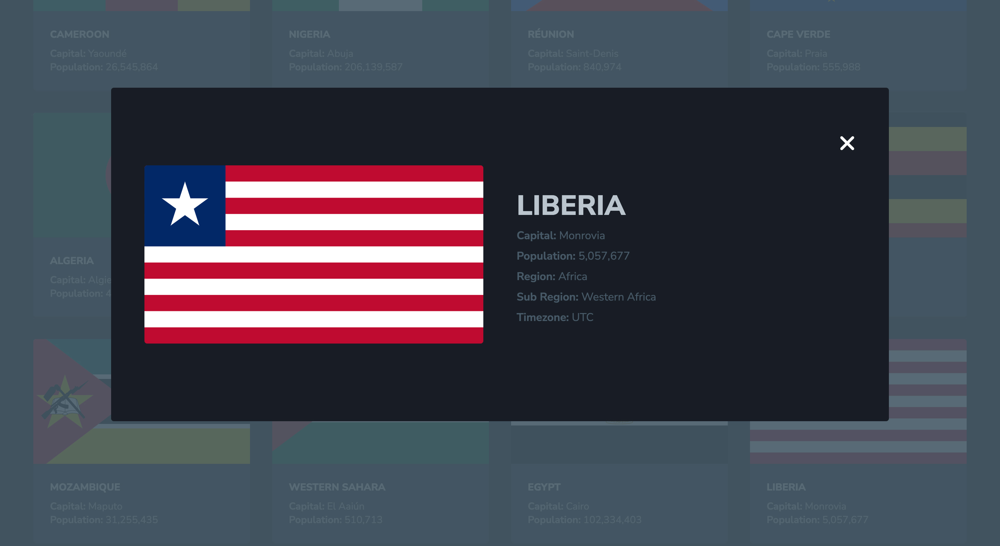
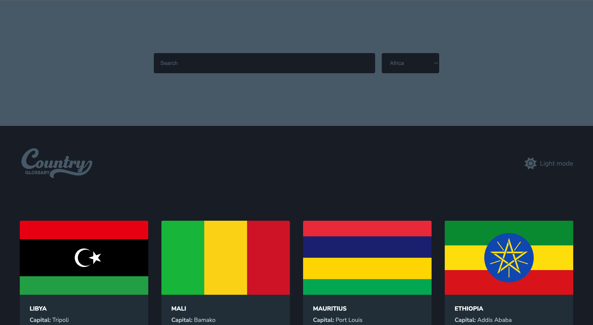
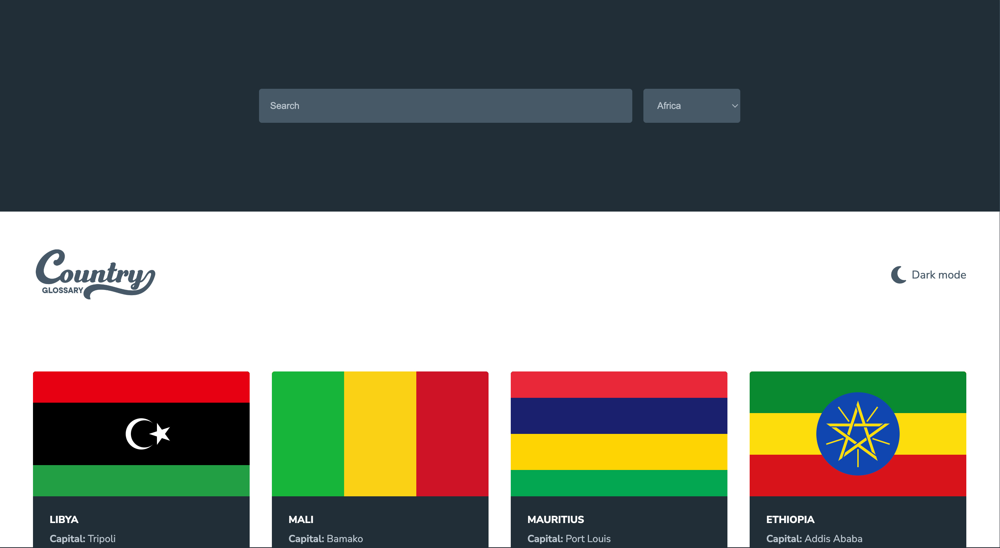
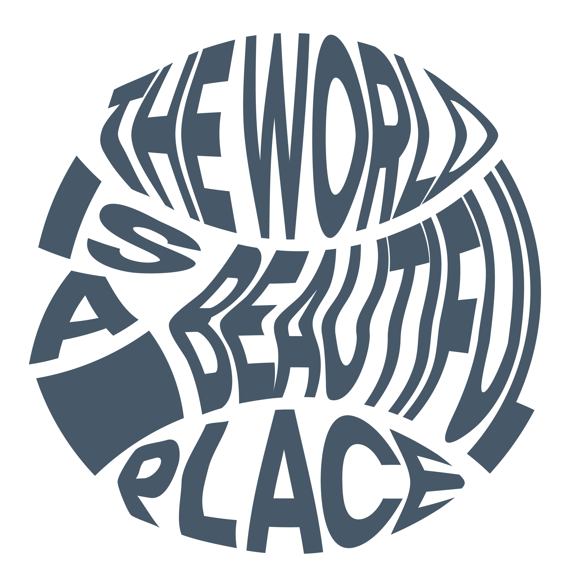

## Overview
#### [Country Glossary](https://github.com/divinestylus/countryGlossary) - Geopolitical App
###### Country Glossary is a digital geopolitical application.

## Features
#### Essential Details About Countries

 

#### Light & Dark Theme

 
 

 

#### Tech Stack
###### HTML
###### CSS
###### JavaScript
###### [API - ](https://restcountries.com/)

###### &copy; 2023 | Designed & Developed by [Sam B. Morris](https://github.com/divinestylus)
